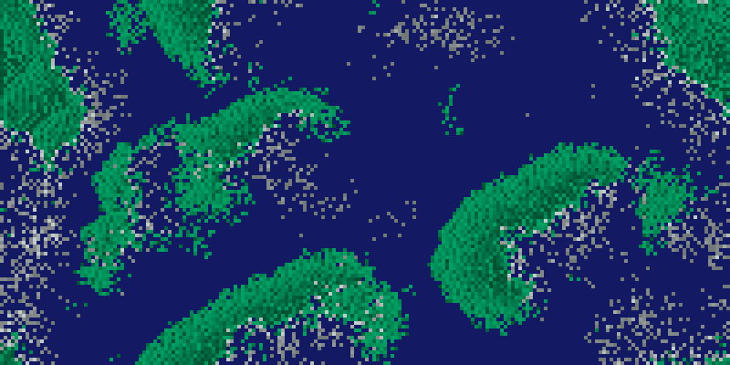
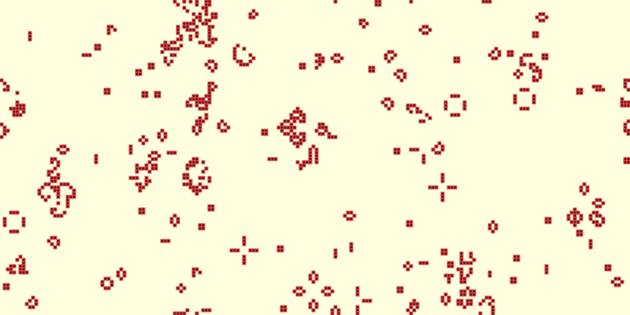
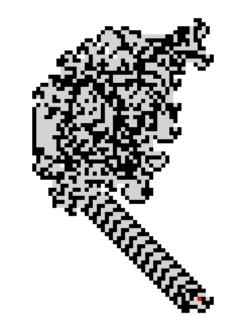
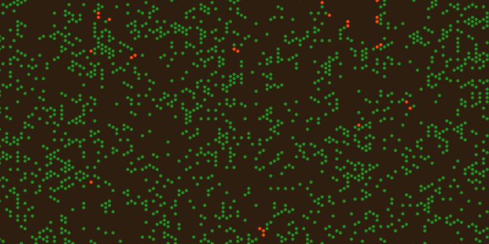
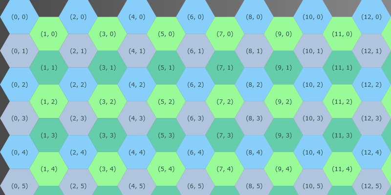

# Extraterrestrial Pets Simulation

## Overview

Welcome to the **Extraterrestrial Pets Simulation** project (_etpetssim_)!
This open-source project aims to create various simple 2D simulations (_Toy models_, _Agent-Based Models_, _Cellular
automaton_) with a top-down view.
The simulation engine organizes the grid into structured cells, each with coordinates and entities, enabling flexible
modeling and efficient computation.
Each cell is a regular polygon —triangle, square, or hexagon— with equal sides and angles, ensuring consistent geometry
and neighbor relationships throughout the grid.
The grid supports various edge behaviors —blocking, wrapping, absorbing, or reflecting— and offers flexible modes for
calculating neighbors, either by shared edges or by both edges and vertices.

**Status:** This project is currently under active development.

## Simulations

### Implemented Simulations

| Name (Wikipedia)                                                               | Sync / Async | Grid Model     | Default Entity    | Entities / Agents / Cells                          |
|--------------------------------------------------------------------------------|--------------|----------------|-------------------|----------------------------------------------------|
| [Wa-Tor](https://en.wikipedia.org/wiki/Wa-Tor)                                 | asynchronous | Array          | 🟦 Water          | Shark 🦈 (many), Fish 🐟 (many)                    |
| [Conway's Game of Life](https://en.wikipedia.org/wiki/Conway%27s_Game_of_Life) | synchronous  | Sparse         | 🟨 Dead           | Alive 🟥 (many)                                    |
| [Langton's Ant](https://en.wikipedia.org/wiki/Langton%27s_ant)                 | asynchronous | Array & Sparse | ⬜ Unvisited       | Ant 🐜 (1 agent), Visited Ground (many, 16 colors) |
| [Forest-fire model](https://en.wikipedia.org/wiki/Forest-fire_model)           | synchronous  | Array          | 🟫 Empty          | Tree 🌲 (many), Burning 🔥 (many)                  |
| [Sugarsacpe](https://en.wikipedia.org/wiki/Sugarscape)                         | asynchronous | Sparse         | None (🟫 Terrain) | 🟨 Sugar (many), 🟦 Agent (many)                   |
| Simulation Lab                                                                 |              | Sparse         | Normal            | Highlighted                                        |

### Planned/Future Simulations

- Snake
- Extraterrestrial Pets Simulation (ET Pets)

### Screenshots

#### Wa-Tor

#### Conway's Game of Life

#### Langton's Ant

#### Forest-fire model
 

#### Sugarscape

#### Simulation Lab

## Goals

- Explore and apply modern Java features in practice.
- Get to know the JavaFX library and gain some initial experience with it.
- Enjoy creativity in developing new simulations and adapting well-known models.

## Development Approach

Artificial intelligence (AI) tools were used during development to enhance productivity and code quality. Specifically,
Microsoft Copilot and GitHub Copilot assisted with code generation, documentation, optimization tasks, learning JavaFX
and MVVM, and making design and architecture decisions.

## Technologies Used

- **Java**: The primary programming language used throughout the project.
- **JavaFX**: Used to create the graphical user interface.
- **Gradle**: Build system used for the project, including a Gradle wrapper.
- **IntelliJ IDEA Community Edition**: The development environment ("IDE") of choice, provided by JetBrains.

This project uses the latest stable versions of all technologies whenever possible.

| Technology     | Version            | URL                                                            |
|----------------|--------------------|----------------------------------------------------------------|
| Java (OpenJDK) | Eclipse Temurin 25 | [adoptium.net](https://adoptium.net/)                          |
| JavaFX         | 25.0.1             | [openjfx.io](https://openjfx.io/)                              |
| Gradle         | 9.2.1              | [gradle.org](https://gradle.org/)                              |
| IntelliJ IDEA  | 2025.2             | [www.jetbrains.com/idea](https://www.jetbrains.com/idea/)      |

## License

This project is licensed under the [MIT License](LICENSE).

This project uses several third-party libraries, each with its own license.
For a complete list, see the [THIRD-PARTY-LICENSES](THIRD-PARTY-LICENSES) file.

Both license files are also available in the application's About dialog.

## Author

- Name: Mathias Kalb
- GitHub: [mkalb](https://github.com/mkalb)
- Project: [Extraterrestrial Pets Simulation](https://github.com/mkalb/etpetssim)
