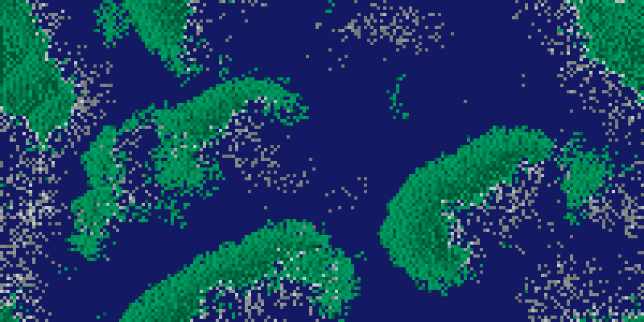
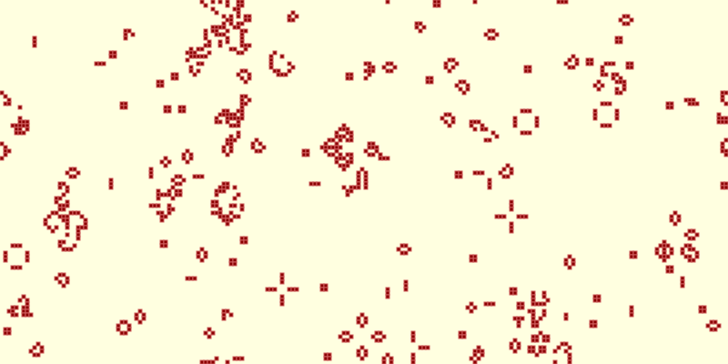
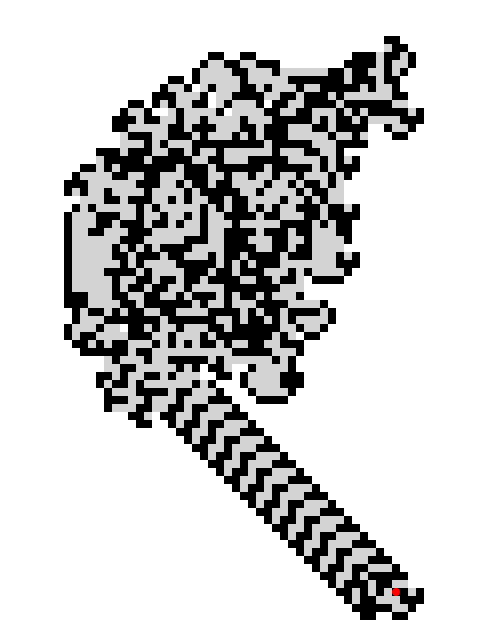
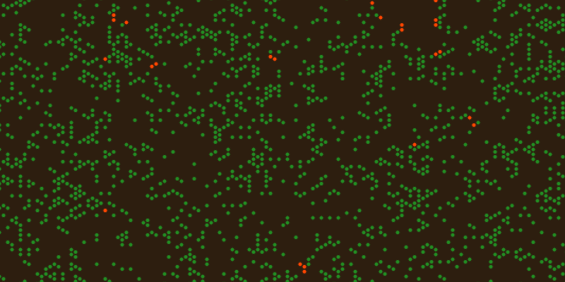
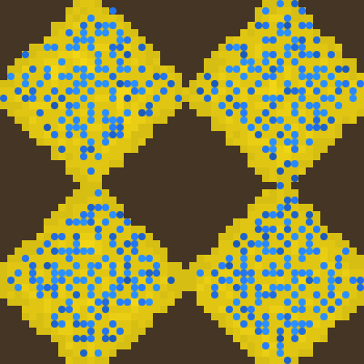
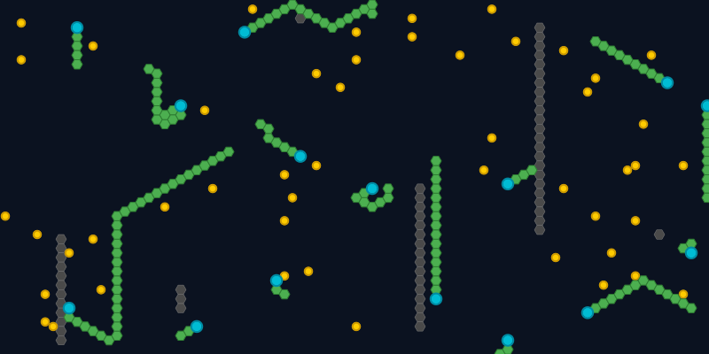
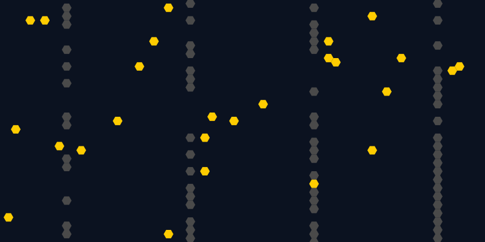
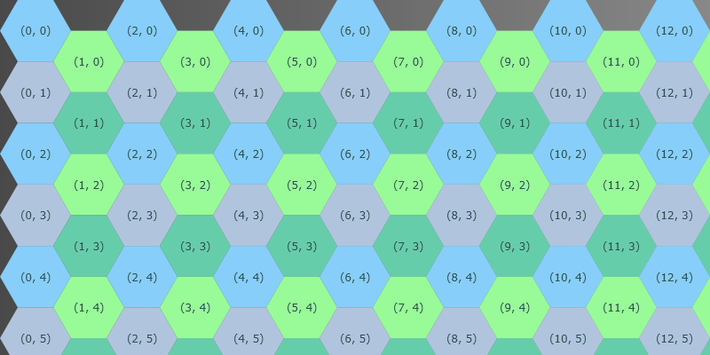
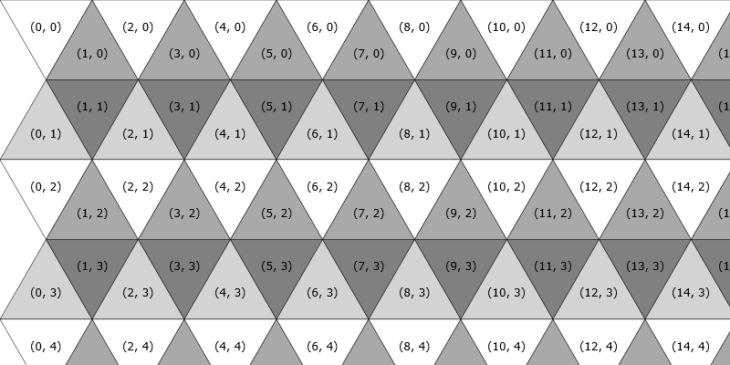
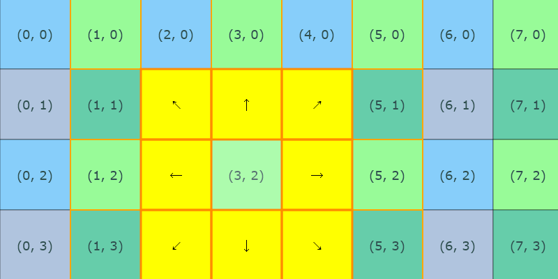

<p align="center">
  
</p>

<h1 align="center">Extraterrestrial Pets Simulation</h1>

<p align="center">
  Simple 2D grid simulations (toy models, agent-based models, and cellular automata) built with Java and JavaFX.
  <br>
  <a href="#simulations">Simulations</a>
  ·
  <a href="#run-the-app">Run the App</a>
  ·
  <a href="docs/simulations">Docs</a>
  ·
  <a href="https://github.com/mkalb/etpetssim/issues">Report an issue</a>
</p>

<p align="center">
  <a href="LICENSE"></a>
  
  
</p>

## Overview

Welcome to the **Extraterrestrial Pets Simulation** project (_etpetssim_)!
This open-source project aims to create various simple 2D simulations (_Toy models_, _Agent-Based Models_, _Cellular
automata_) with a top-down view.
The simulation engine organizes the grid into structured cells, each with coordinates and entities, enabling flexible
modeling and efficient computation.
Each cell is a regular polygon —triangle, square, or hexagon— with equal sides and angles, ensuring consistent geometry
and neighbor relationships throughout the grid.
The grid supports various edge behaviors —blocking, wrapping, or absorbing— and offers flexible modes for
calculating neighbors, either by shared edges or by both edges and vertices.

**Status:** This project is currently under development.

**Maintainer note:** This is a single-developer project maintained by me (Mathias Kalb).

## Simulations

| Simulation                                                                     | Type               | Description                                                                                          | Docs                                            |
|--------------------------------------------------------------------------------|--------------------|------------------------------------------------------------------------------------------------------|-------------------------------------------------|
| ET Pets                                                                        | Agent-Based Model  | Agents search for plants and insects, avoid obstacles, create trails, and reproduce with inheritance | [etpets.md](docs/simulations/etpets.md)         |
| [Wa-Tor](https://en.wikipedia.org/wiki/Wa-Tor)                                 | Agent-Based Model  | Agents (fish and sharks) interact in a predator–prey system                                          | [wator.md](docs/simulations/wator.md)           |
| [Conway's Game of Life](https://en.wikipedia.org/wiki/Conway%27s_Game_of_Life) | Cellular Automaton | Cells evolve based on simple local birth and survival rules                                          | [conway.md](docs/simulations/conway.md)         |
| [Langton's Ant](https://en.wikipedia.org/wiki/Langton%27s_ant)                 | Cellular Automaton | A moving ant updates cell states using simple rules                                                  | [langton.md](docs/simulations/langton.md)       |
| [Forest-fire model](https://en.wikipedia.org/wiki/Forest-fire_model)           | Cellular Automaton | Cells model tree growth and fire spread through local rules                                          | [forest.md](docs/simulations/forest.md)         |
| [Sugarscape](https://en.wikipedia.org/wiki/Sugarscape)                         | Agent-Based Model  | Agents collect and consume sugar resources                                                           | [sugar.md](docs/simulations/sugar.md)           |
| [Snake](https://en.wikipedia.org/wiki/Snake_(video_game_genre))                | Agent-Based Model  | Snakes move, grow, and avoid collisions while consuming food                                         | [snake.md](docs/simulations/snake.md)           |
| Rebounding Entities                                                            | Agent-Based Model  | Entities move directionally, bounce off boundaries, and destroy obstacles and other agents           | [rebounding.md](docs/simulations/rebounding.md) |
| Simulation Lab                                                                 | Development Tool   | Testing environment for grid rendering and cell shapes                                               | —                                               |

For a detailed inventory of simulation entity types, see
the [Simulation Entity Catalog](docs/simulations/Simulation_Entity_Catalog.md).

### Simulation Gallery

#### ET Pets

(Screenshots will be added once the simulation is fully implemented.)

#### Wa-Tor



#### Conway's Game of Life



#### Langton's Ant



#### Forest-fire model



#### Sugarscape



#### Snake



#### Rebounding Entities



#### Simulation Lab





## Goals

- Explore and apply modern Java features in practice.
- Get to know the JavaFX library and gain some initial experience with it.
- Enjoy creativity in developing new simulations and adapting well-known models.

## Development Approach

Artificial intelligence (AI) tools are used during development to improve productivity and support code quality. In
particular, Microsoft Copilot, GitHub Copilot, and Claude Code are used for code generation, documentation support,
refactoring and optimization tasks, the application icon (SVG), and as a practical aid while learning and applying
JavaFX and MVVM concepts. These tools also help accelerate exploration of implementation variants and architecture
options during day-to-day development.

At the same time, all generated content is reviewed and adapted in the context of the project goals, codebase
consistency, and long-term maintainability. AI support is therefore treated as development assistance, while final
technical decisions remain project-driven and under maintainer control.

## Feedback and Issues

Bug reports and improvement suggestions are very welcome.
Please open a [GitHub Issue](https://github.com/mkalb/etpetssim/issues) if you find a problem or have an idea to improve
the project.

If possible, include:

- clear steps to reproduce (for bugs),
- expected vs. actual behavior,
- screenshots or logs.

## Run the App

### Platform Support

| Platform      | Status                                                                     |
|---------------|----------------------------------------------------------------------------|
| Windows (x64) | Supported                                                                  |
| Linux         | Not supported yet (the Gradle build selects only the Windows JavaFX files) |
| macOS         | Not supported yet (the Gradle build selects only the Windows JavaFX files) |

JavaFX artifacts are platform-specific. `app/build.gradle.kts` currently resolves only the Windows x64 variant and fails
with a clear error message on any other operating system or architecture.
Supporting Linux or macOS would require extending the platform detection in that file.

### Prerequisites

- Windows x64
- Java 27
- Git (building the JAR reads the revision and commit date from the Git working tree)

### Commands

Use the Gradle Wrapper from the repository root. No global Gradle installation is required.

```powershell
# Run the application
.\gradlew.bat :app:run

# Run the application with command-line arguments (English UI, log output on the console)
.\gradlew.bat :app:run --args="--locale=en --log-console"

# Run the unit tests (excludes skill tests)
.\gradlew.bat :app:test

# Run the tests for the repository skills in .claude/skills
.\gradlew.bat :app:skillTest

# Build the distribution ZIP
.\gradlew.bat :app:distZip
```

Supported application arguments:

| Argument              | Description                                                                                                                |
|-----------------------|----------------------------------------------------------------------------------------------------------------------------|
| `--help`              | Prints the list of arguments and exits                                                                                     |
| `--locale=<locale>`   | Sets the UI language: `en`, `de`, `en_US`, or `de_DE` (case-sensitive); default: system locale, otherwise `en_US`          |
| `--log-console`       | Enables logging to the console                                                                                             |
| `--log-file`          | Enables logging to the file `ExtraterrestrialPetsSimulation.log` in the application's log directory                        |
| `--log-level=<level>` | Sets the log level: `debug`, `info`, `warn`, or `error` (case-insensitive); default: `info`                                |
| `--simulation=<name>` | Starts a simulation directly, e.g. `wator`, `conway`, `langton`, `forest`, `sugar`, `snake`, `rebounding`, `etpets`, `lab` |

Flags can also take a boolean value, e.g. `--log-console=false`. Arguments must not contain spaces. Several arguments
are
passed to Gradle as one quoted string, separated by spaces.

## Technologies Used

- **Java**: The primary programming language used throughout the project.
- **JavaFX**: Used to create the graphical user interface.
- **Gradle**: Build system used for the project, including a Gradle wrapper.
- **IntelliJ IDEA Community Edition**: The development environment ("IDE") of choice, provided by JetBrains.

This project uses the latest stable versions of all technologies whenever possible.

| Technology     | Version            | URL                                                       |
|----------------|--------------------|-----------------------------------------------------------|
| Java (OpenJDK) | Eclipse Temurin 27 | [adoptium.net](https://adoptium.net/)                     |
| JavaFX         | 27                 | [openjfx.io](https://openjfx.io/)                         |
| Gradle         | 9.8.0              | [gradle.org](https://gradle.org/)                         |
| IntelliJ IDEA  | 2026.x             | [www.jetbrains.com/idea](https://www.jetbrains.com/idea/) |

## License

This project is licensed under the [MIT License](LICENSE).

This project uses several third-party libraries and tools, each with its own license.
For the project's third-party list, see the [THIRD-PARTY-LICENSES](THIRD-PARTY-LICENSES) file.

Both license files are also available in the application's About dialog.

## Author

- Name: Mathias Kalb
- GitHub: [mkalb](https://github.com/mkalb)
- Project: [Extraterrestrial Pets Simulation](https://github.com/mkalb/etpetssim)

Copyright (c) 2025-2026 Mathias Kalb
