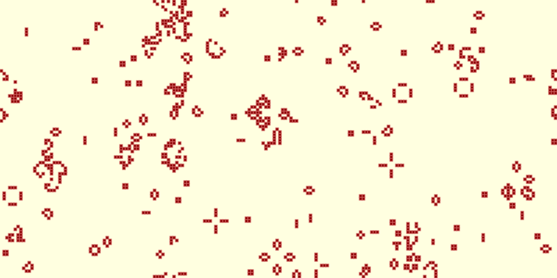

# Conway's Game of Life

Simulate Conway's Game of Life

## Overview

Conway's Game of Life models a population of living and dead cells whose next
generation depends only on their neighbors. Starting from a random population
or a pattern placed by the user, cells are born, survive, or die together in
discrete generations. Alternative cell shapes and rule presets let the same
basic idea produce many different forms of growth, motion, and stability.

## Category and grid

- **Category:** Cellular automaton
- **Cell shapes:** Square (default), Triangle, Hexagon
- **Edge behavior:** Wrap X and Y (default), Block X and Y
- **Neighborhood:** Edges and vertices

## Rules and mechanics

- At startup, the configured percentage of grid cells is selected randomly and
  made alive; the seed controls whether that starting population is repeatable.
- Each generation counts the living neighbors around every relevant cell,
  including cells that touch by an edge or a vertex.
- A living cell stays alive only when its neighbor count is selected in the
  survival rule; otherwise it becomes dead.
- A dead cell becomes alive only when its neighbor count is selected in the
  birth rule. Birth without a living neighbor is not available.
- All cells are evaluated from the same current generation, and their results
  appear together in the next generation.
- Wrapping edges connect opposite sides of the grid; blocked edges do not.

## Entities

- **Living Cell:** An active cell that may survive or die in the next
  generation according to the transition rules.
- **Dead Cell:** An inactive cell that may become alive when its neighboring
  population matches a birth rule.

## Interactive editing

- **Clear Grid:** Sets every cell to dead and applies globally.
- **Toggle Cell:** Changes the selected cell from dead to alive or from alive
  to dead.
- **Place Pattern:** Places the selected predefined pattern with its top-left
  corner at the selected cell. The complete pattern must fit on the grid.

The **Pattern** selector offers Still Life: Beehive, Still Life: Block, Still
Life: Boat, Still Life: Loaf, Still Life: Tub, Oscillator: Beacon, Oscillator:
Blinker, Oscillator: Pentadecathlon, Oscillator: Pulsar, Oscillator: Toad,
Methuselah: Acorn, Methuselah: R-pentomino, Spaceship: Glider, and Spaceship:
Lightweight Spaceship (LWSS) for square cells using Conway's Life rules.
Replicator: HighLife Replicator is available for square cells using HighLife
rules. Other shapes and custom rule sets do not provide predefined patterns.

## Configuration

You can configure the grid and its appearance, choose the initial population,
and select or create the transition rules used for every generation.

### Structure

Choose Square (default), Triangle, or Hexagon cells; Wrap X and Y (default) or
Block X and Y edges; and a grid width and height from 8 to 1,000 cells. The
default grid is 200 cells wide and 100 cells high.

### Layout

Set the cell edge length from 1 to 50 pixels (4 by default). Cells can appear
as Shape, Bordered shape (default), Inner circle, or Bordered inner circle.

### Initialization

Set a seed to reproduce the same random starting grid, or leave it blank for a
random seed. **Alive Cells** controls the initial proportion from 0% to 100%,
with 30% as the default; selecting a preset also shows its recommended starting
density.

### Rules

The default transition rule is Conway's Life, `23/3`: living cells survive with
two or three living neighbors, and dead cells become alive with three. Rules
use S/B notation, with survival counts before the slash and birth counts after;
you can enter the notation directly or select the **Stays Alive** and **Becomes
Alive** neighbor counts.

Each cell shape also has named presets. Square presets are Conway's Life
(default), 2x2, 34 Life, Amoeba, Anneal, Coagulations, Coral, Day & Night,
Diamoeba, Gnarl, HighLife, Life Without Death, Maze, Mazectric, Move,
Replicator, and Seeds. Triangle presets are Sierpinski, Tri 25/3, Tri 45/456,
Tri Life, and Tri Majority. Hexagon presets are Hex 34 Life, Hex Gliders, Hex
HighLife, Hex Life, Snowflake, and Sugar. Available neighbor counts adjust to
the selected cell shape.

## Screenshot

## References

- https://en.wikipedia.org/wiki/Conway%27s_Game_of_Life
