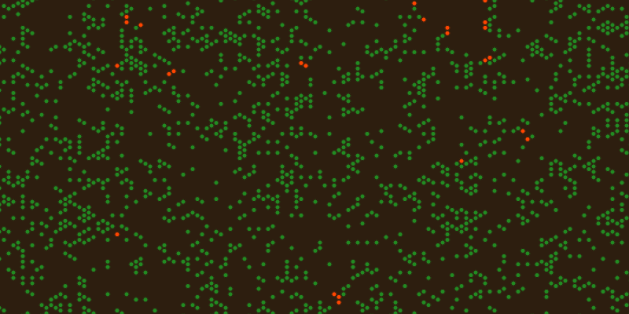

# Forest-fire model

Simulate the Forest-fire model.

## Overview

The forest-fire model shows how a forest of trees grows, catches fire, and
regrows over time on a grid of cells. Each cell is either empty ground, a
tree, or a burning tree. Trees spontaneously sprout in empty cells, fire
spreads from burning neighbors, and rare lightning strikes ignite trees on
their own, producing a self-organizing cycle of growth and destruction.

## Category and grid

- **Category:** Cellular automaton
- **Cell shapes:** Hexagon (default), Square, Triangle
- **Edge behavior:** Blocked at the grid border (default), or wrapped around
  (toroidal)
- **Neighborhood:** Edge-adjacent neighbors only (default)

## Rules and mechanics

- The grid starts with a configurable percentage of cells set to Tree and the
  rest Empty; no cell starts burning.
- Each step, every cell is updated at the same time based on its current
  state (synchronous update).
- An Empty cell may spontaneously grow a Tree, based on the tree growth
  probability.
- A Tree cell catches fire and becomes Burning if any neighboring cell is
  currently burning.
- A Tree cell may also ignite on its own due to a lightning strike, based on
  the (usually very small) lightning ignition probability.
- A Burning cell always burns out completely within one step, turning back
  into an Empty cell.
- Over many steps this produces recurring waves of forest growth followed by
  fires that clear it, without ever needing outside intervention.

## Entities

- **Empty:** Bare ground with no tree; can grow a new tree over time.
- **Tree:** A living tree; can catch fire from a burning neighbor or from a
  lightning strike.
- **Burning:** A tree currently on fire; always turns into empty ground in
  the next step.

## Interactive editing

- **Cycle State:** Applied to the currently selected cell. Cycles it through
  Empty → Tree → Burning → Empty, letting you manually plant trees, start a
  fire, or clear a cell.

## Configuration

### Structure

Choose the cell shape (hexagon, square, or triangle), how the grid edges
behave (blocked or wrapped), and the grid width and height.

### Layout

Set the rendered cell edge length and the cell display mode (shape, bordered
shape, circle, bordered circle, or emoji).

### Initialization

Set the random seed and the initial tree density, the percentage of cells
that start as trees.

### Rules

Choose the neighborhood mode used for fire spread, the tree growth
probability for empty cells, and the lightning ignition probability for
spontaneous tree fires.

## Screenshot

## References

- [Forest-fire model](https://en.wikipedia.org/wiki/Forest-fire_model)

