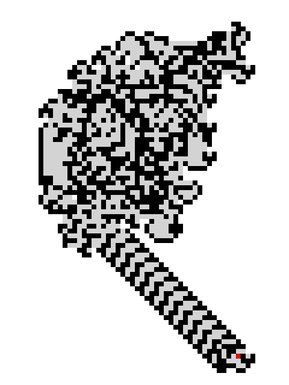

# Langton's Ant

Simulate Langton's Ant

## Overview

Langton's Ant explores how a simple set of movement rules can produce complex
patterns. Ants travel across a grid of changing ground states, turn according to
the state they enter, and leave a trail as those states advance.

## Category and grid

- **Category:** Cellular automaton
- **Cell shapes:** Square (default), Triangle, Hexagon
- **Edge behavior:** Wrap X and Y (default), Absorb X and Y
- **Neighborhood:** Edges only

## Rules and mechanics

- A run starts with one north-facing ant near the center of the grid, on ground
  state 1.
- On each step, an ant moves to the adjacent cell in its current direction.
- The ant turns according to the rule assigned to the ground state it enters,
  then that ground advances to the next state in the rule cycle.
- A previously unvisited destination begins at state 0 before its rule is
  applied.
- With wrapping edges, ants crossing a boundary reappear on the opposite side.
  With absorbing edges, they leave the simulation instead.
- If an ant tries to enter a cell already occupied by another ant, the moving
  ant is removed.

## Entities

- **Langton's Ant:** A moving agent whose direction changes according to the
  ground state it enters. At larger cell sizes, an arrow shows its direction.
- **Ground cells:** Initially unvisited cells that cycle through one state per
  configured turn. The visible trail records where ants have traveled.

## Interactive editing

- **Add Ant:** Adds an ant to the selected unvisited, unoccupied cell and sets
  that cell to ground state 1. For square cells, choose North, East, South, or
  West; for hexagon cells, choose North, Northeast, Southeast, South,
  Southwest, or Northwest. Triangle cells choose North or South automatically
  from the selected triangle's orientation.
- **Remove Ant:** Removes an ant from the selected cell without changing its
  ground state.

## Configuration

You can choose the grid geometry and rendering, then select a preset or enter a
custom turn rule suited to that geometry.

### Structure

Choose Square (default), Triangle, or Hexagon cells; Wrap X and Y (default) or
Absorb X and Y edges; and a grid width and height from 100 to 2,000 cells. Both
dimensions default to 200 cells.

### Layout

Set the cell edge length from 1 to 50 pixels (4 by default), and display cells
as Shape (default) or Bordered shape.

### Rules

The turn rule defaults to `RL` and contains 2 to 16 turns. Use `L` and `R` for
left and right, `L2` and `R2` for double turns, `N` for no turn, and `U` for a
U-turn; triangle cells accept only `L`, `R`, and `U`.

Shape-specific presets are available: triangle offers `RL`, `RLL`, and `URR`;
square offers `RL`, `RLR`, `RLLR`, `RRLL`, `RNNU`, `RLLLLLRRL`, and
`RRLLLRLLLRRR`; hexagon offers `RL`, `NR`, `R2N`, `RL2`, `NR2`, `R2RR`,
`R2NNRR2R`, and `RR2NUR2RL2`. Each preset menu also has a blank selection for
entering a custom rule.

## Screenshot

## References

- https://en.wikipedia.org/wiki/Langton%27s_ant
