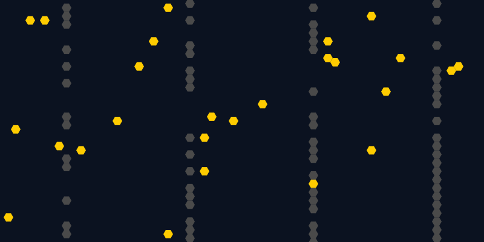

# Rebounding Entities

Simulate rebounding entities

## Overview

Rebounding Entities models directionally moving agents in a grid containing
ground and walls. Moving entities travel from cell to cell, rebound from blocked
boundaries and walls, and gradually clear obstacles or eliminate one another
when collisions occur.

## Category and grid

- **Category:** Agent-based model
- **Cell shapes:** Hexagon (default), Square
- **Edge behavior:** Block X and Y (default)
- **Neighborhood:** Edges and vertices (default), Edges only

## Rules and mechanics

- A new grid starts with evenly spaced, full-height vertical walls and a
  configurable percentage of moving entities placed randomly on free ground.
- Each moving entity starts in a random direction supported by the selected
  cell shape and neighborhood mode.
- Entities act one at a time in grid-position order and move one neighboring
  cell in their current direction when that cell is ground.
- At a blocked grid boundary, an entity stays in place and changes direction as
  if it had bounced from the edge.
- On hitting a wall, an entity stays in place, rebounds, and removes that wall.
- On hitting another moving entity, the active entity moves into the occupied
  cell and removes the other entity.

## Entities

- **Ground Cell:** An empty cell that moving entities can enter and that can be
  replaced with a wall or a new rebounder while editing.
- **Wall Cell:** A stationary obstacle that is removed when a moving entity
  rebounds from it.
- **Moving Entity:** A direction-bearing agent that crosses ground, rebounds
  from boundaries and walls, and removes another moving entity on collision.

## Interactive editing

- **Add Wall:** Replaces the selected ground cell with a wall.
- **Remove Wall:** Replaces a wall in the selected cell with ground.
- **Remove Rebounder:** Removes a moving entity from the selected cell.
- **Fill Walls:** Replaces every free ground cell with a wall across the grid.
- **Add Rebounder:** Adds a rebounder to the selected ground cell in the chosen
  **Direction**. Hexagon grids offer North, Northeast, Southeast, South,
  Southwest, and Northwest. Square grids also offer East and West when the
  neighborhood includes vertices; with edges only, they offer North, East,
  South, and West.

## Configuration

The configuration controls the grid geometry and appearance, its randomized
starting state, and which neighboring cells moving entities can enter.

### Structure

Choose Hexagon (default) or Square cells and set the grid width and height, up
to 1,000 cells in each dimension. Grid boundaries always block movement on both
axes.

### Layout

Set the cell edge length from 1 to 50 pixels (8 by default) and display cells as
Shape (default) or Bordered shape.

### Initialization

Set a repeatable random seed or leave it blank for a random run. Choose 0 to 100
Vertical Walls (2 by default) and an initial Moving Entities percentage from 0%
to 10% (2% by default).

### Rules

Choose Edges and vertices (default) or Edges only as the Neighborhood Mode used
for movement and collision directions.

## Screenshot

