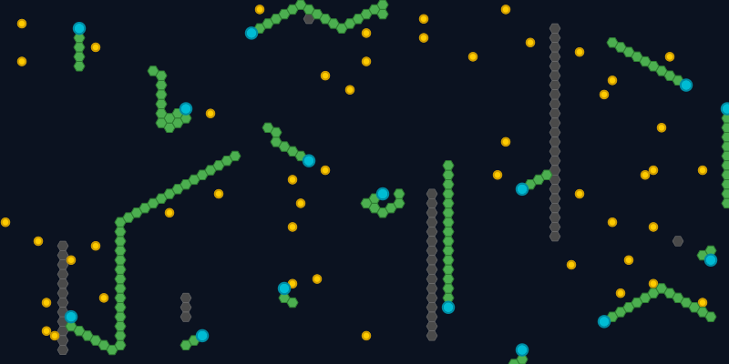

# Snake

Simulate the classic Snake game

## Overview

Snake models multiple autonomous snakes competing for food on a single grid.
Each snake follows a movement strategy, grows as it eats, and must navigate
around walls, other snakes, and its own body.

## Category and grid

- **Category:** Agent-based model
- **Cell shapes:** Hexagon (default), Square
- **Edge behavior:** Wrap X and Block Y (default), Block X and Y, Wrap X and Y,
  Block X and Wrap Y
- **Neighborhood:** Edges only (fixed)

## Rules and mechanics

- The grid starts with configurable numbers of vertical wall segments, food
  cells, and snakes. Walls vary in height, while snakes and food are placed on
  random free cells.
- Each snake uses one of several strategies to choose an adjacent ground or
  food cell. Its head moves there, the former head becomes a body segment, and
  the tail shortens unless the snake still has pending growth.
- Eating food adds the configured pending growth, awards base points plus a
  length-based bonus, and places replacement food on another free cell.
- A snake dies when it has no valid move. Permanent Death removes it; Respawn
  (default) returns its head to a random free cell and resets its growth.
- Initial snakes receive the available movement strategies in rotation. The
  strategies can favor momentum, open ground, food, vertical or horizontal
  movement, and clustered or spread-out paths.
- Square cells provide four movement directions and hexagons provide six.
  Walls, occupied cells, and the selected edge behavior determine which moves
  remain available.

## Entities

- **Ground:** An unoccupied cell where food, walls, or a snake can be placed.
- **Wall:** A fixed obstacle that snakes cannot enter.
- **Growth Food:** A consumable item that increases a snake's pending growth
  and score.
- **Snake Head:** The moving agent that chooses a route and leads its body.
- **Snake Segment:** One cell of the body chain left behind by a moving head.

Dead snakes use warm colors, while selecting a snake highlights its head and
complete body chain.

## Interactive editing

All edit tools apply to the currently selected cell:

- **Add Food:** Places food on a ground cell.
- **Remove Food:** Turns food back into ground.
- **Add Wall:** Places a wall on a ground cell.
- **Remove Wall:** Turns a wall back into ground.
- **Add Snake:** Places a new snake head on a ground cell using the selected
  strategy. The Strategy selector offers `M`, `V M`, `H M`, `G`, `G M`, `F`,
  `F M`, `F V C+`, `F H C+`, `F V C-`, `F H C-`, `F V M`, `F H M`,
  `F M C+`, and `F M C-`, combining momentum, ground or food preference,
  directional bias, and clustering or spreading behavior.
- **Remove Snake:** Removes an entire snake when either its head or one of its
  segments is selected.

## Configuration

The configuration controls the grid, its presentation, the starting layout,
and how snakes grow, score, and recover from death.

### Structure

Choose Hexagon or Square cells, select one of the four edge behaviors, and set
the grid width and height from 12 to 1,000 cells. The defaults are Hexagon,
Wrap X and Block Y, 80 cells wide, and 40 cells high.

### Layout

Set the cell edge length from 1 to 50 pixels; the default is 6 pixels. Cells
are displayed as Bordered shape.

### Initialization

Leave Seed blank for a random run, or enter a number or text for a repeatable
layout. Set Vertical Walls (default 6, range 0-100), Food Cells (default 50,
range 0-10,000), Snakes (default 15, range 0-1,000), and Initial Pending
Growth for each snake (default 2, range 0-1,000).

### Rules

Choose Death Mode as Respawn (default) or Permanent Death. Set Growth per Food
(default 1, range 0-100), Base Points per Food (default 10, range 0-100), and
the Segment Length Multiplier used for bonus points (default 0.5, range
0.0-5.0).

## Screenshot

## References

- https://en.wikipedia.org/wiki/Snake_(video_game_genre)
