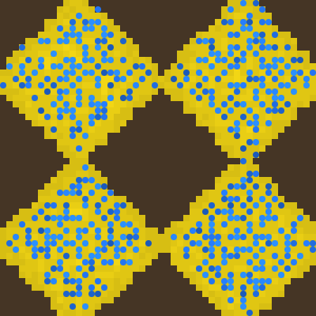

# Sugarscape

Simulate the Sugarscape world.

## Overview

Sugarscape models a population of foraging agents living on a landscape of
sugar resources. Sugar accumulates in peaks scattered across the grid, and
agents move around each step to find and harvest the sweetest reachable spot
within their sight, spending energy to survive and dying when they run out of
energy or grow too old. When an agent dies, a new one is spawned elsewhere,
keeping the population roughly constant over time.

## Category and grid

- **Category:** Agent-based simulation
- **Cell shapes:** Square (default), Hexagon
- **Edge behavior:** Wrap X/Y (default), Block X/Y, Block X/Wrap Y, Wrap X/Block Y
- **Neighborhood:** Fixed to edge-adjacent neighbors only; not user-configurable

## Rules and mechanics

- At startup, sugar peaks are placed at fixed positions on the grid (one center peak for an odd count, corner peaks added for higher counts), and sugar spreads outward from each peak in rings, decreasing from a maximum near the peak to a minimum at the configured radius limit, with a small amount of random noise.
- Agents are seeded onto a random percentage of cells, each starting with the configured initial energy.
- Each step, agents act in random order: an agent looks around within its vision range, in the neighbor directions of the grid, and picks the reachable free cell with the highest sugar amount, preferring a closer cell (or its own cell) on ties.
- The agent moves one step toward the chosen cell (or stays if it is already there or the target is blocked), then harvests all sugar from its new cell.
- The agent spends energy for metabolism every step; it dies if its energy drops to zero or below, or once it reaches the maximum age.
- Whenever an agent dies, a new agent with fresh energy is spawned on a random free cell, keeping the agent population roughly stable.
- After all agents have acted, every sugar cell regenerates a fixed amount of sugar, up to its own maximum.

## Entities

- **Terrain:** The empty ground cells that make up the grid background.
- **Sugar:** A resource cell holding an amount of sugar between zero and a per-cell maximum; its brightness reflects how much sugar it currently holds, from empty to full.
- **Agent:** A creature that moves, eats sugar, and expends energy; its brightness reflects its current energy level. Newly spawned agents are drawn with a white ring around them.

## Interactive editing

While the simulation is running, two tools are available for the currently selected cell:

- **Add sugar:** Sets the selected cell's sugar to a chosen level (Low, Medium, or High, relative to the configured maximum sugar amount), selectable from a dropdown next to the tool.
- **Remove sugar:** Clears the sugar resource from the selected cell.

## Configuration

### Structure

Choose the cell shape, grid size, and edge behavior for the grid.

### Layout

Adjust the rendered cell edge length and cell display mode.

### Initialization

Set the random seed, the initial percentage of agents, the number and spread radius of sugar peaks, the maximum sugar amount per cell, and each agent's initial energy.

### Rules

Tune the sugar regeneration rate, agent metabolism rate, agent vision range, and agent maximum age.

## Screenshot

## References

- https://en.wikipedia.org/wiki/Sugarscape

