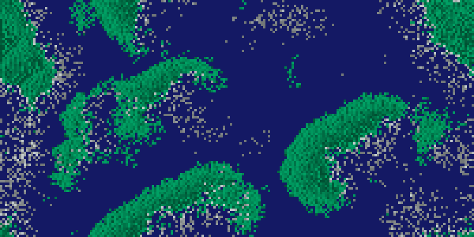

# Wa-Tor

Simulate the Wa-Tor world

## Overview

Wa-Tor is a predator-prey simulation set on a grid representing a toroidal
ocean. Fish and sharks move, age, reproduce, and (for sharks) hunt and lose
energy over time. Watching the grid, you see fish populations grow into open
water while sharks chase them down, with both populations rising and falling
in cycles as the simulation runs.

## Category and grid

- **Category:** Agent-based simulation
- **Cell shapes:** Square (default), Triangle, Hexagon
- **Edge behavior:** Wrap (default), Block
- **Neighborhood:** Edge-adjacent neighbors only (default); configurable

## Rules and mechanics

- Each step, every fish and shark acts once, in grid-position order.
- A fish moves to a random neighboring open-water cell, if one is available.
- A fish reproduces once it reaches a minimum age and enough time has passed
  since its last reproduction, leaving a new fish behind at its old position.
- A fish that reaches its maximum age dies and its cell becomes open water.
- A shark loses energy every step and moves onto a neighboring fish if one is
  present, eating it and gaining energy; otherwise it moves to a random
  neighboring open-water cell if one is available.
- A shark reproduces once it has moved, reached a minimum age, has enough
  energy, and enough time has passed since its last reproduction.
- A shark that reaches its maximum age or runs out of energy dies and its
  cell becomes open water.
- At startup, fish and sharks are placed at random positions according to
  their configured population shares, with randomized starting ages so the
  population is not perfectly synchronized.
- The simulation ends once all sharks are gone and either no fish remain, or
  fish have overrun the ocean.

## Entities

- **Fish:** A prey creature that swims to open water, ages, and reproduces
  when old enough. Its display color darkens as it approaches its maximum
  age.
- **Shark:** A predator creature that hunts nearby fish for energy, otherwise
  swims to open water. Its display color brightens with higher energy levels.
- **Water:** The open ocean terrain that fish and sharks swim through.

## Interactive editing

While the simulation is running, you can apply the following tools to the
currently selected cell:

- **Add fish:** places a fish on the selected cell if it is open water.
- **Add shark:** places a shark on the selected cell if it is open water.
- **Remove creature:** removes a fish or shark from the selected cell,
  turning it back into open water.

## Configuration

You can adjust the grid structure and appearance, the starting populations,
and the life-cycle rules for fish and sharks separately.

### Structure

Choose the cell shape, grid size, and edge behavior (wrap-around or blocked
edges).

### Layout

Set the rendered cell edge length and how cells are displayed (filled shape,
bordered shape, circle, bordered circle, or emoji).

### Initialization

Set the random seed and the initial population shares for fish and sharks;
their combined share cannot exceed the full grid.

### Rules

Choose the neighborhood mode used for movement and hunting, then set the
fish life cycle (maximum age, minimum reproduction age, minimum reproduction
interval) and the shark life cycle (maximum age, birth energy, energy loss
per step, energy gained per fish eaten, minimum reproduction age, minimum
reproduction energy, minimum reproduction interval) in their own panes.

## Screenshot

## References

- https://en.wikipedia.org/wiki/Wa-Tor

